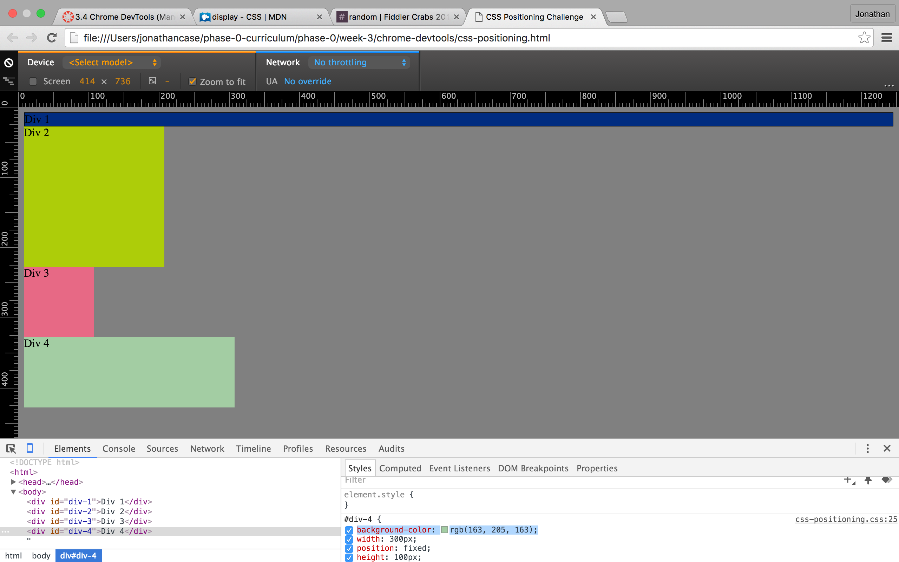
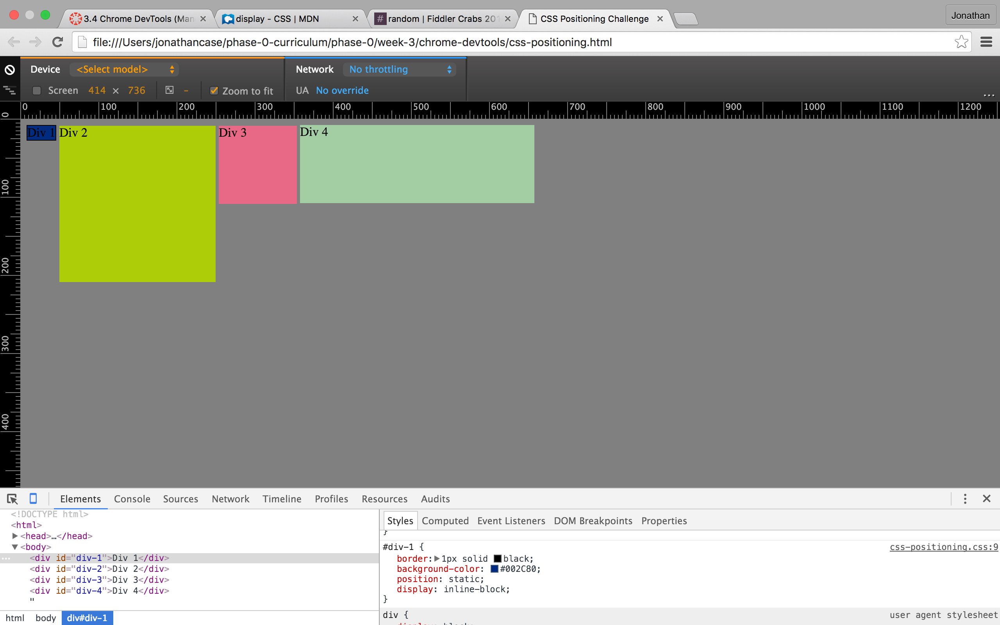
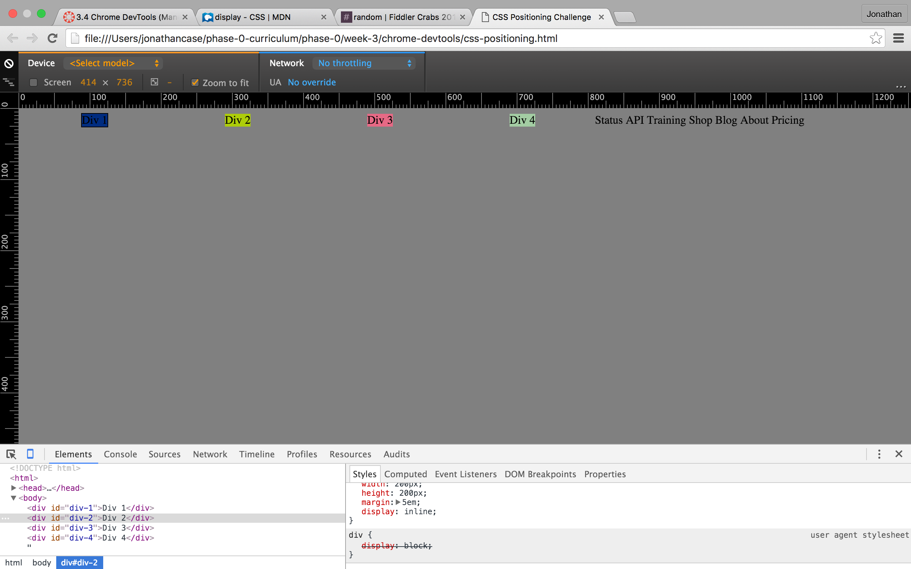
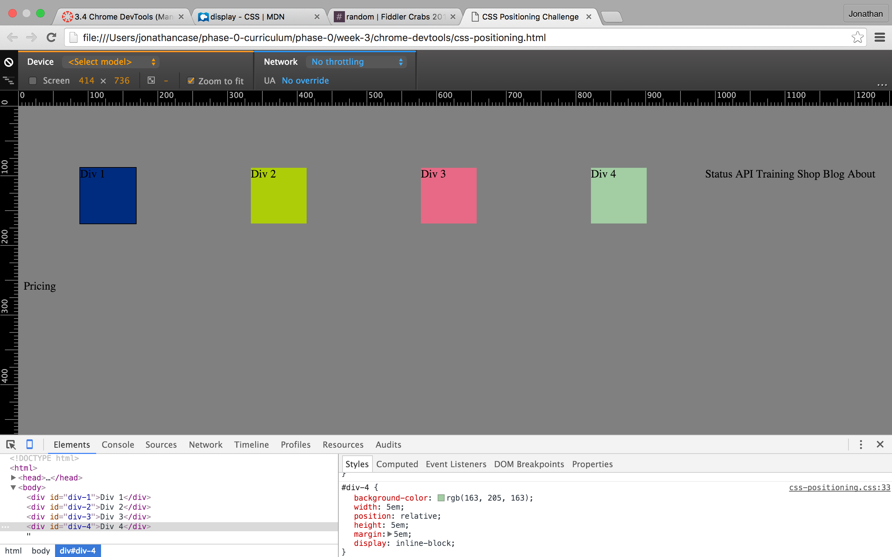
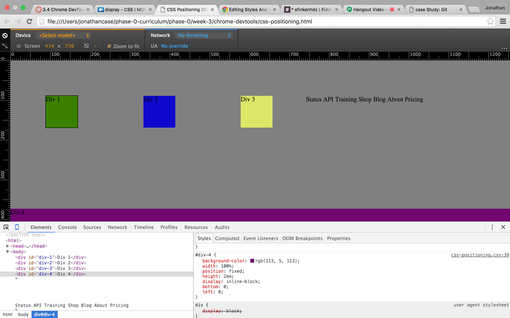
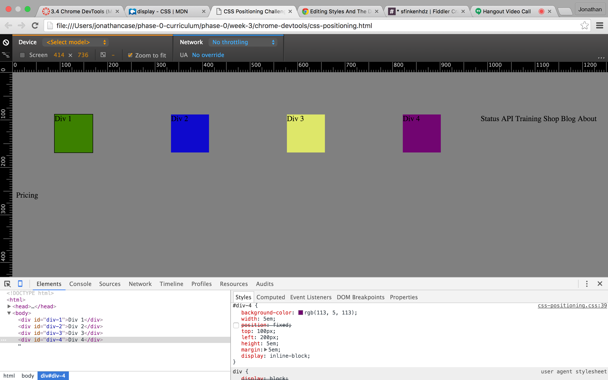
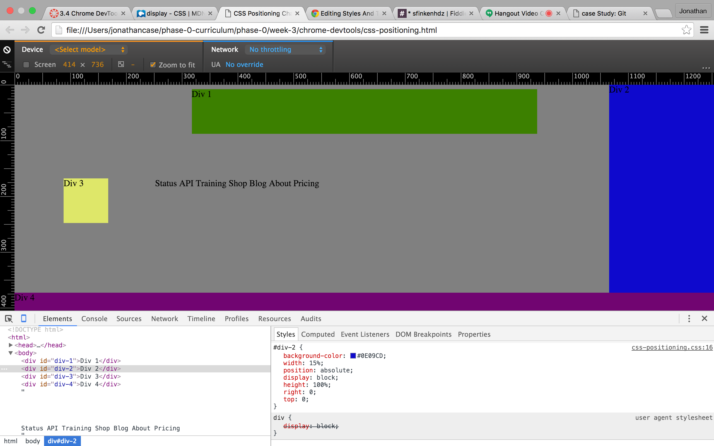
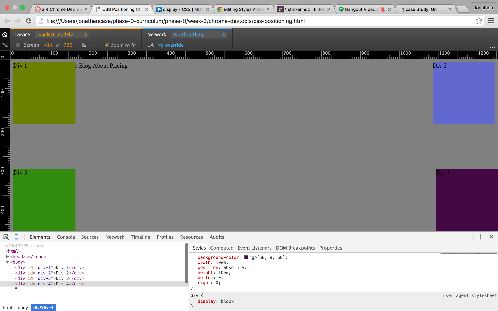

##How can you use Chrome's DevTools inspector to help you format or position elements?
Chrome's DevTools give you a visual aid to help you format and position elements.

##How can you resize elements on the DOM using CSS?
You can use the width and heigh properties to directly resize elements.

##What are the differences between absolute, fixed, static, and relative positioning? Which did you find easiest to use? Which was most difficult?

Fixed positioning means that the object will stay where it is regardless of how you scoll down the page. It is "fixed" to that spot. Relative positioning means that the position will be manipulated relative to where it would naturally be, not relative to other elements. Static is the default positioning. Absolute means that the object will react to its nearest HTML ancestor.

Currently, I was able to replicate all of the figures in the challenge, but I didn't really understand how I was doing it. I plan on reading more to gain further understanding.

##What are the differences between margin, border, and padding?

Margin is the space between the object and the border. Margin is shared between elements. The border is the edge of the actual element. Padding is the space between the content and the border.

##What was your impression of this challenge overall? (love, hate, and why?)
I feel mixed about the challenge. I think that having a visual to move around is good, but I wish that there was more explanation as to why its reacting. I understand that much of what we do is self teaching, but I do with there was more instructed learning to this challenge.

