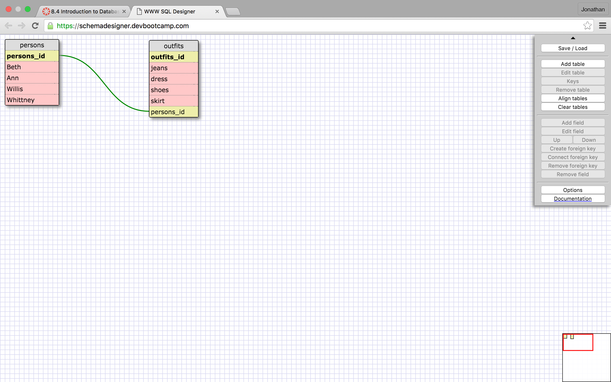

What are databases for?

Databases are for storing large amount of information effieciently. 

What is a one-to-many relationship?

A one to many relationship is a way to link data from differnt tables in order to limit empty space in your data.

What is a primary key? What is a foreign key? How can you determine which is which?

The primary key is the key of the table that you are linking from, where as the foriegn key is from the table that you are linking to. You can determine which is which based off of the current table that you are working or sorting from.

How can you select information out of a SQL database? What are some general guidelines for that?

Yes, command in SQL are stacked until a semicolon is presented. Your basic methods are SELECT, FROM, ORDER BY, INNER JOIN, WHERE.

