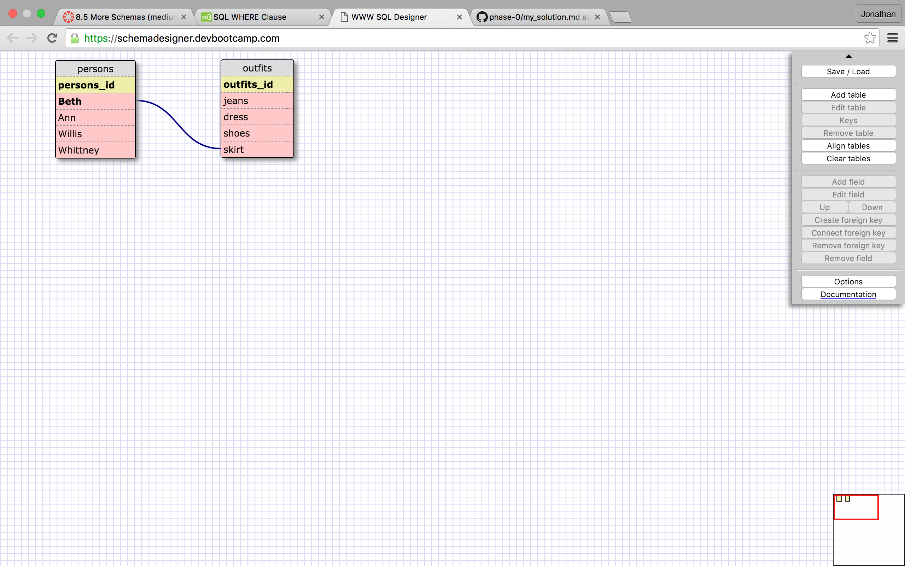
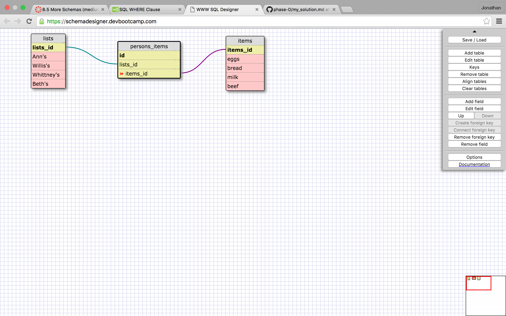

Here I used a one to one schema to show that Beth only ever wears skirts. Since the others may or may not wear skirts, resulting in a null value, and Beth always wears them, a one to one schema is warranted.

What is a one-to-one database?

A one to one database is used when they always correlate to the one item. 

When would you use a one-to-one database? (Think generally, not in terms of the example you created).

You would use a one to one database to make the query more efficient.

What is a many-to-many database?

Geeze, even though I think I understand the concept it is hard to explain.... A many to many relationship is when you have two or mor sets of data that can correlate with each other in numerous ways.

When would you use a many-to-many database? (Think generally, not in terms of the example you created).

If you had two sets of data with multiple moving pieces, you could create a many to many relationship.

What is confusing about database schemas? What makes sense?

Many to many seems inefficient, I would imagine that you would want to create as many one to many relationships as possible. I would say when to use one to one and many to many is the most confusion part.

